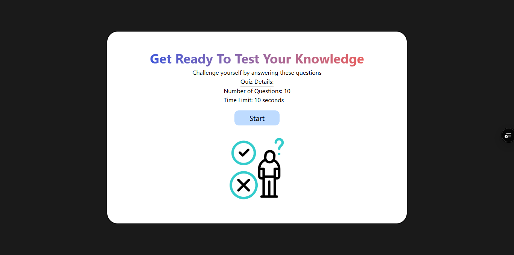
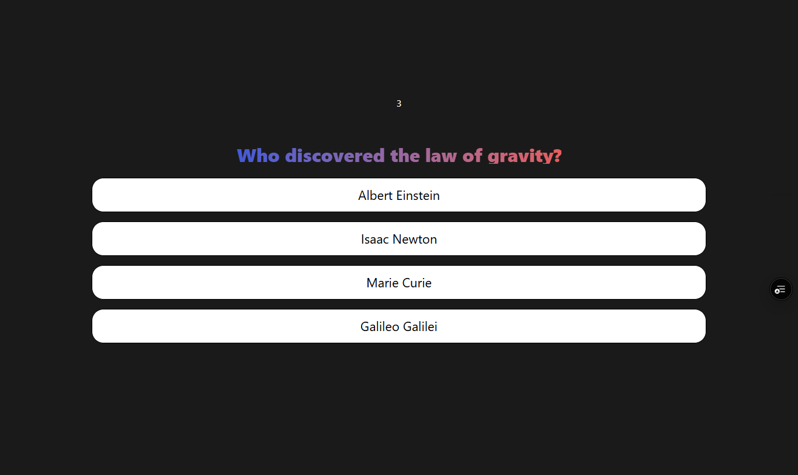
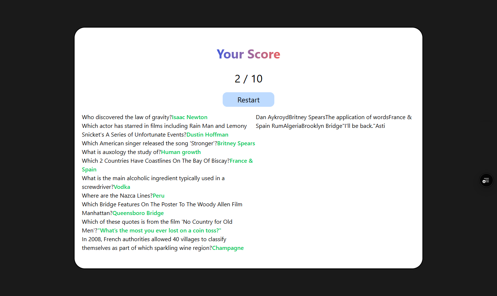

# Project Name
- Quiz App

## Project View
- 

## App Description
- 
- 

## About
- This web app requires any user to start a quiz on general knowledge type questions whereby a he/she answers ten questions in total with a 10 second time interval per question

## Answering
- Each user requires a mouse to navigate through and anwer the questions

## Design
- This design was made by me

## Built With
- HTML 5
- CSS styles
- JavaScript
- React js
- Vite

## Prerequisites
Knowledge about
- HTML
- CSS
- JavaScript

## Clone project
To get a copy to your local directory:
- Clone the repository by running 'git clone "https://github.com/SalahVincent/Quiz-App' on your terminal
To change to the folder project directory:
- Change to the project directory by running: 'cd quiz-app' on the terminal

## Starting project
To start this app:
- run 'npm install'
- run 'npm run dev'
 on your command line/terminal

## Live site
-[Link](https://quiz-r6nklio9j-vincent-salahs-projects.vercel.app/)

## Author
**Vincent Salah**

- GitHub:
[@SalahVincent](https://github.com/SalahVincent)

## Show your support
Give me a star if you like this project!